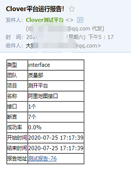
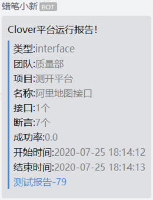

# 通知功能
Clover通知支持邮件、企业微信机器人和钉钉机器人三种方式。邮件方式和企微机器人方式的通知可以直接发送测试报告内容，测试报告内容包含报告在平台上的地址；目前钉钉机器人不支持直接发送测试报告内容，只能发送报告在平台上的地址。  

# 配置域名
用户点击通知里的报告链接可以打开测试报告页面，因此测试报告需要知道您部署的测试平台域名。域名配置在clover/config.py全局配置文件里。  
1. 如果您是开发者，请修改DOMAIN为http://localhost:3000   
2. 如果您是用户，请修改您部署的域名或IP地址（端口也需要），例如您将平台部署在10.23.25.36机器上，使用8080端口则这里配置DOMAIN=http://10.23.25.36:8080
# 配置邮件
使用邮件通知功能，您需要配置邮件服务器、发件人、发件人密码和收件人列表。  
1. 配置发件人：修改clover/config.py中的NOTIFY['channel']['email']['sender']为发件人邮箱地址；  
2. 配置收件人：修改clover/config.py中的NOTIFY['channel']['email']['receiver']为发收人邮箱地址，可配置多个收件人；  
3. 配置服务器：修改clover/config.py中的NOTIFY['channel']['email']['smtp_host']为您使用的smtp服务器地址；  
    QQ邮箱：smtp.qq.com  
    搜狐邮箱：smtp.sohu.com  
    126邮箱：smtp.126.com  
    163邮箱：smtp.163.com  
4. 配置密码：注意，大部分邮箱不能使用邮箱登录密码，以QQ邮箱为例，登录邮箱首页->设置->账户->开启服务(POP3/SMTP服务)，通过发送短信方式可以获取密码，使用此密码才能自动发送邮件。
# 配置企微
企业微信支持创建群机器人，您需要先建立一个机器人，将机器人key配置到clover/config.py中的NOTIFY['channel']['wechat']。
# 配置钉钉
钉钉支持创建群机器人，您需要先建立一个机器人，将机器人access token配置到clover/config.py中的NOTIFY['channel']['dingtalk']。
