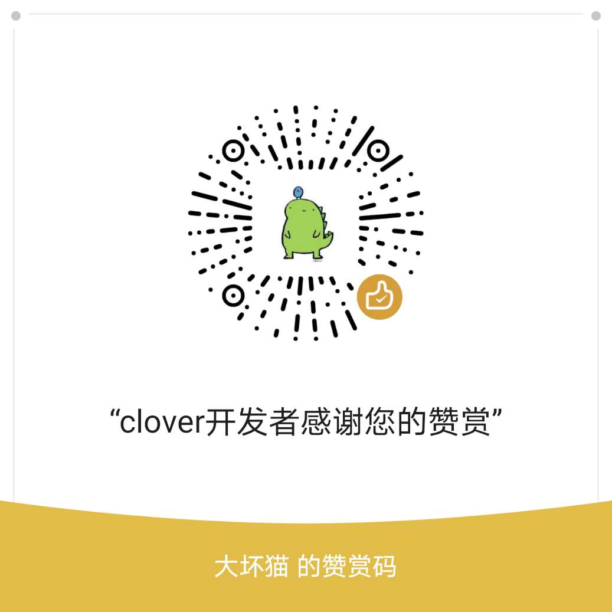

# Clover
Clover是简单易用的开源测试平台。  
## 平台特点：
* 部署简单  
平台架构全部采用使用最广泛，最被测试开发人员所熟识的技术，以python语言为平台核心，采用vue设计平台页面，redis做消息队列，mysql进行数据存储，nginx作为静态服务和反向代理工具。平台支持docker部署，使开发部署更加容易。
* 注重效率  
平台支持接口与套件提交，编辑，删除和运行，但强烈建议用户采用postman导出collection文件，或charles导出har文件的形式，采用插件来创建接口测试用例，提升接口测试用例创建效率。平台采用redis作为消息队列，支持分部式运行，执行效率高。
* 关注体验  
平台架构设计能对大部分错误进行拦截，给用户有好的错误提示。

## 家族介绍：
- clover 采用python flask框架搭建clover服务后台
- datura 利用docker实现平台一键部署
- lilac  clover平台jenkins持续集成插件

## 安装依赖：
* redis  5.0 及以上 （依赖stream模式）
* mysql  5.7 及以上 （依赖json类型存储）
* nginx  1.4 及以上
* python 3.6 及以上
* node & npm       （编译vue静态资源）

# 用户指南
## 安装说明
## 快速上手
## 使用教程
## 问题反馈
## 常见问题

# 加入我们
## 开发环境
## 加入我们

# 捐赠打赏

